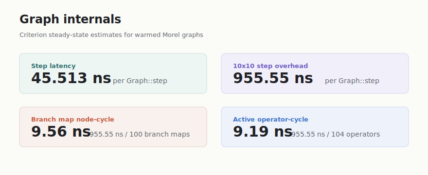
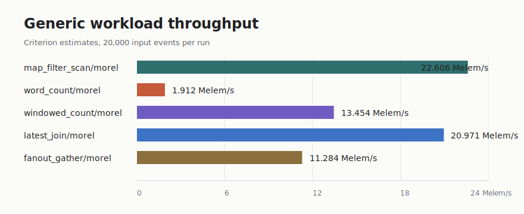

# Morel Benchmark Report

Measured on 2026-07-08.

Every published number in this report comes from Criterion. The benchmark suite measures Morel graph internals: graph construction, warmed `Graph::step` cost, operator dispatch overhead, and generic stream-processing workloads. It does not include adapter, network, producer pacing, or external system latency.

## Headline Metrics

| Metric | Measured Value | How To Read It |
| --- | ---: | --- |
| `step_latency/pipeline` | 45.513 ns per `Graph::step` | warmed graph-internal pipeline |
| `step_overhead/10x10` | 955.55 ns per `Graph::step` | 10 branches, 10 maps per branch |
| Branch map node-cycle overhead | 9.56 ns per node-cycle | `955.55 ns / 100` branch map nodes |
| All active operator-cycle overhead | 9.19 ns per operator-cycle | `955.55 ns / 104` active operators |
| `map_filter_scan/morel` | 22.606 Melem/s | 20,000-event generic workload |
| `latest_join/morel` | 20.971 Melem/s | 20,000-event generic workload |





## What The Suites Measure

The graph suite isolates framework mechanics:

- `step_latency/pipeline`: one warmed `Graph::step` on a small
  ticker -> map -> scan -> map -> filter -> sink pipeline.
- `step_overhead`: one warmed `Graph::step` on fixed topologies, including the
  `10x10` graph used for node-cycle derivation.
- `graph_build`: construction cost for wiring streams, operators, and sinks.
- `map_chain`, `fanout`, `sparse_activation`, `timer_pressure`, and
  `payload_size`: specific scheduler, topology, timer, and payload costs.

The workload suite measures generic stream-processing shapes with 20,000 input
events per run:

- `map_filter_scan`: projection, filtering, and stateful running aggregation.
- `word_count`: text tokenization plus stateful keyed counts.
- `windowed_count`: tumbling and sliding window summaries.
- `latest_join`: a value stream combined with the latest control stream and
  sampled by a trigger stream.
- `fanout_gather`: one source feeding multiple transforms and recombining.

## Results

### Graph-Internal Latency

| Benchmark | Estimate | 95% Interval | Throughput |
| --- | ---: | ---: | ---: |
| `step_latency/pipeline` | 45.513 ns/step | 45.028-46.080 ns | 21.972 Melem/s |

This is the headline latency number for graph internals. The graph is built,
started, and warmed before Criterion measures the steady-state `Graph::step`
call. The result is not an end-to-end IO measurement.

### Graph Overhead

| Benchmark | Estimate | 95% Interval | Derived Rate |
| --- | ---: | ---: | ---: |
| `step_overhead/10x10` | 955.55 ns/step | 953.96-957.35 ns | 9.56 ns per branch map node-cycle |

Derivation:

- The benchmark topology has 10 branches with 10 pass-through maps per branch:
  `10 * 10 = 100` branch map node-cycles per step.
- The Criterion run reports 955.55 ns per `Graph::step`.
- Branch map node-cycle overhead is `955.55 ns / 100 = 9.56 ns`.
- Including source, counter, merge, and sink, 104 operators are active each
  step; counted that way, `955.55 ns / 104 = 9.19 ns` per active operator-cycle.

### Generic Workloads

| Workload | Events/run | Estimate | 95% Interval | Throughput |
| --- | ---: | ---: | ---: | ---: |
| `map_filter_scan/morel` | 20,000 | 884.72 us | 875.66-892.82 us | 22.606 Melem/s |
| `word_count/morel` | 20,000 | 10.462 ms | 10.451-10.473 ms | 1.912 Melem/s |
| `windowed_count/morel` | 20,000 | 1.4866 ms | 1.4800-1.4929 ms | 13.454 Melem/s |
| `latest_join/morel` | 20,000 | 953.69 us | 942.75-964.70 us | 20.971 Melem/s |
| `fanout_gather/morel` | 20,000 | 1.7725 ms | 1.7567-1.7926 ms | 11.284 Melem/s |

## How To Read The Numbers

`step_latency/pipeline` is a steady-state latency estimate for Morel's internal
engine loop on a compact pipeline. Use it when reasoning about the minimum cost
of advancing a running graph.

`step_overhead/10x10` is the dispatch-overhead benchmark. It keeps one topology
running and measures only the cost of advancing that topology by one engine
cycle. The derived node-cycle numbers are arithmetic breakdowns of the same
Criterion estimate.

Graph build numbers are construction cost. They include creating streams,
operators, and sink wiring before a run starts, so they should not be mixed with
steady-state dispatch numbers.

Payload clone cost appears in workloads that clone or allocate user payloads.
For example, `word_count` splits each input line and converts each word to an
owned `String`; that cost is part of the workload result.

## Machine And Build Profile

| Item | Value |
| --- | --- |
| OS | Darwin 24.6.0, arm64 |
| Kernel | `Darwin Kernel Version 24.6.0: Mon Jul 14 11:28:30 PDT 2025; root:xnu-11417.140.69~1/RELEASE_ARM64_T6030` |
| CPU | Apple M3 Pro |
| Rust | `rustc 1.92.0 (ded5c06cf 2025-12-08)` |
| Cargo profile | bench target uses optimized release settings |
| Release settings | `opt-level=3`, `debug=false`, `lto="fat"`, `codegen-units=1`, `panic="abort"`, `overflow-checks=false` |

## Reproduction

Measured runs used for this report:

```sh
cargo bench -p morel --bench graph -- 'step_overhead/10x10|step_latency/pipeline'
cargo bench -p morel --bench workloads -- 'map_filter_scan|word_count|windowed_count|latest_join|fanout_gather'
rustc --version
uname -a
sysctl -n machdep.cpu.brand_string
```

## Updating This Report

1. Run the measured commands above on the target machine.
2. Use Criterion's `target/criterion/**/new/estimates.json` values for every
   reported benchmark row. Prefer `slope` when present; use `mean` for rows
   where Criterion does not produce a slope estimate.
3. Recompute derived node-cycle rates from the same `step_overhead/10x10`
   estimate used in the graph table.
4. Regenerate `morel/benchmarks/images/*.svg` from the same values used in the
   tables.
5. Re-run the smoke checks and the markdown sanity search before committing.
